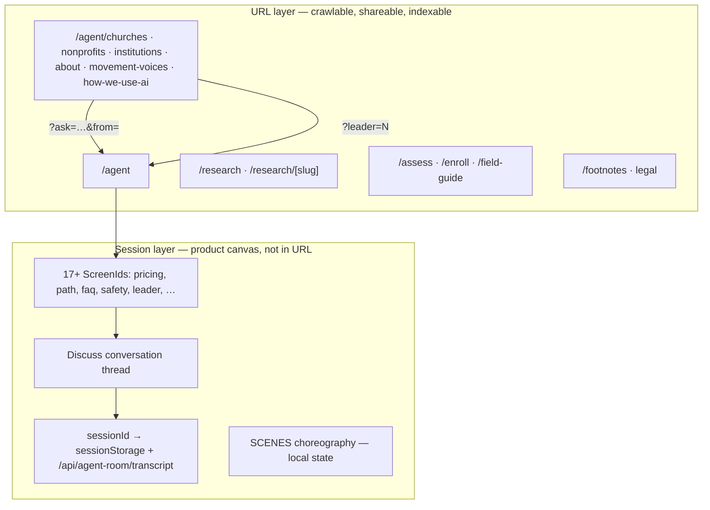

# Agentic architecture, URL linking, and amplification prognosis

**Path:** `docs/build/notes/agentic-architecture-url-linking-seo-geo-assessment.md`  
**As of:** 2026-07-01  
**Scope:** movemental.ai as a single deployment — agent-first product shell, document surfaces, research corpus, funnels, and tenant data layer.  
**Question addressed:** Given our agentic structure, is amplification blocked unless we massively overhaul URL structure — and is fixing that as simple as rewiring URLs?

**Related (prior notes, not superseded — this doc consolidates the strategic read):**

- [single-surface-url-architecture-seo-and-analytics.md](./single-surface-url-architecture-seo-and-analytics.md) — URL trade-offs and analytics model
- [movemental-site-audit.md](./movemental-site-audit.md) — live vs source inventory
- [agent-platform-complete-reference.md](./agent-platform-complete-reference.md) — route and funnel topology
- [../research/articles/05-seo-geo-discoverability.md](../research/articles/05-seo-geo-discoverability.md) — editorial/strategic framing
- [../../articles/graded-high/added/85-99/linking-strategy-eeat-geo-playbook.md](../../articles/graded-high/added/85-99/linking-strategy-eeat-geo-playbook.md) — linking playbook

---

## Executive summary

**Verdict:** The platform is not structurally condemned to poor discoverability because it is agentic. The current amplification ceiling is primarily a **product-phase choice**, not a hard architectural constraint. However, **rewiring URLs alone is not sufficient**. Amplification requires a deliberate **two-layer model**: keep the agent room as the product canvas, and restore or expand a **crawlable document graph** with stable slugs, internal links, entity pages, and honest metadata.

| Question | Short answer |
|----------|--------------|
| Is single-URL agentic UX required by the stack? | **No.** Tenant isolation is `TENANT_ORG_ID` + `organization_id`, not public path count. |
| Is poor SEO/GEO inevitable with an agent room? | **No.** The room can coexist with many indexable routes; `/research/[slug]` and `/agent/*` documents already prove the pattern. |
| Is it as simple as rewiring URLs? | **Partly.** Redirects, sitemap, and canonicals are rewirable in days. **Content topology, in-room deep links, structured data, and internal linking** are the harder, necessary work. |
| Can this amplify without a “massive overhaul”? | **Yes, if phased.** A controlled expansion from ~7 sitemap URLs to a intentional document graph is achievable without abandoning the agent-first shell. |
| Biggest current risk? | **Redirect consolidation + missing routes** — inbound links and entity pages collapse to `/agent`, losing slug-level intent and E-E-A-T surface area. |

---

## 1. The architecture in linking terms

Movemental.ai today operates as **two coexisting layers** that are easy to conflate:



### 1.1 URL layer (amplification substrate)

These are **real routes** with `page.tsx`, metadata, and (when launch-ready) indexability:

| Cluster | Routes | Role for SEO/GEO |
|---------|--------|------------------|
| Agent hub | `/agent` | Brand + product signal; crawlable fallback copy in initial HTML |
| Agent documents | `/agent/churches`, `/agent/nonprofits`, `/agent/institutions`, `/agent/about`, `/agent/how-we-use-ai`, `/agent/movement-voices`, `*/deck` | Long-form proof, audience fit, trust |
| Research corpus | `/research`, `/research/[slug]`, `/research/findings`, `/research/sources` | **Best current pattern** — static params, dedicated metadata, extractable prose |
| Conversion funnels | `/assess`, `/enroll`, `/field-guide` | Intent-specific landing; should stay URL-addressable |
| Citations / EEAT registry | `/footnotes` | Trust and sourcing legibility |
| Legal | `/terms`, `/privacy`, `/cookies` | Trust baseline |

**Code anchors:** `src/app/agent/*/page.tsx`, `src/app/research/[slug]/page.tsx`, `src/app/sitemap.ts`, `src/lib/site-url.ts`.

### 1.2 Session layer (product canvas)

Inside `/agent`, navigation is **in-app state**, not path segments:

- **Screens:** closed set in `src/lib/agent-room/acts.ts` (`home`, `pricing`, `faq`, `path`, `leader`, `safetyFlow`, …).
- **Scenes:** ordered act lists in `src/lib/agent-room/data/scenes.ts`.
- **Regex routing:** user utterances map to scenes via `src/lib/agent-room/route-input.ts` — still no URL change.
- **Conversations:** Discuss thread + `sessionId` in `sessionStorage`; restore via `GET /api/agent-room/transcript?sessionId=`.

A visitor can traverse pricing → safety → path → contact **without the address bar changing**. That is excellent product UX and **hostile to classic URL-based discovery** unless you deliberately bridge the layers.

### 1.3 What the six-layer / multi-tenant stack actually requires

From `src/lib/tenant.ts` and the shared Supabase DB model:

- **Required:** `organization_id` scoping on tenant rows; RLS; services filtered by tenant context.
- **Not required:** a single public slug, subdomain-per-org on this deployment, or path-prefix multi-tenancy.

Alan Hirsch and other movement leaders are **separate deployments** (custom domain or subdomain). movemental.ai is the **organizational** surface. URL diversity on this app does not break tenant isolation.

**Implication:** You can add fifty indexable pages tomorrow; they still write to the same org when `TENANT_ORG_ID` is set. The agent room and the document graph are **orthogonal concerns** at the data layer.

---

## 2. Is it as simple as rewiring URLs?

**No — but URL rewiring is the necessary first move, not the whole program.**

### 2.1 What “rewiring URLs” would fix (relatively simple)

These are configuration and routing tasks — days to low weeks, not a platform rewrite:

| Fix | Effort | Impact |
|-----|--------|--------|
| Repair redirect targets in `next.config.ts` so 301s land on **live** routes, not dead paths | Low | Stops link rot; preserves inbound equity |
| Unblock entity routes blocked by redirects (e.g. `/about/[slug]` vs `/about/:path* → /agent`) | Low | Restores founder/person E-E-A-T pages |
| Expand `src/app/sitemap.ts` to include `/research/*`, `/agent/*` documents, `/footnotes` | Low | Honest crawl discovery |
| Canonical policy: permanent home redirect, one canonical per intent | Low | Consolidates ranking signals |
| Launch gate: `NEXT_PUBLIC_SITE_LAUNCH_READY=1` when ready (`src/lib/site-launch.ts`) | Trivial | Removes preview `noindex` |
| Restore or implement planned slugs: `/voices/[slug]`, articles, `/about/[slug]` | Medium | Entity-level link targets |

### 2.2 What rewiring alone cannot fix (the real amplification work)

| Gap | Why URLs aren't enough |
|-----|------------------------|
| **In-room content** (pricing, FAQ, path stages) | Lives in `ScreenId` state — no unique URL, OG tag, or anchor unless you add deep links |
| **Article corpus** | `src/lib/articles.ts` exists; **no `src/app/**/articles/` routes** — content without address |
| **Internal link graph** | Orphan research pages, no hub-and-spoke from `/agent` documents to `/research/[slug]` |
| **Structured data** | Person, Organization, Article, FAQ schema largely absent on live surfaces |
| **Cross-network links** | Scenius/trusted-voice graph requires per-leader URLs on tenant apps **and** hub links on movemental.ai |
| **Extractable GEO passages** | Models cite crisp, attributed blocks — prose must be segmented for lift, not only routed |
| **Analytics identity** | Scene funnels need event instrumentation (`agent-room-analytics-events.md`), not path reports |

### 2.3 The hybrid bridge (minimum viable linking without killing the agent)

You do **not** need to revert to a 46-route marketing site. You need **explicit bridges**:

1. **Document routes stay canonical** for anything that must rank, be cited, or be emailed (`/agent/how-we-use-ai`, `/research/seo-geo-discoverability`).
2. **Agent deep links** for product entry — already started in `src/lib/agent-room/deep-link.ts`:
   - `/agent?leader=N` — leader screen by index
   - `/agent?ask=…&from=<segment>` — handoff from document pages (params cleared after consumption)
3. **Optional scene params or subpaths** — `/agent/pricing` or `/agent?scene=pricing` — for shareable in-room destinations without duplicating full pages.
4. **Every document page links back** to `/agent` with a structured handoff, not duplicate room copy.

This preserves the creative agentic shell while giving the web graph **stable nodes**.

---

## 3. Current state — honest inventory

*Verified against source, July 2026.*

### 3.1 Public route count

~52 live `page.tsx` routes. For amplification purposes, only a **subset** matter:

| Category | Count (approx.) | Indexable when launch-ready? |
|----------|-----------------|------------------------------|
| Agent documents + decks | 10 | Yes (with metadata) |
| Research | 4 + ~15 slugs | Yes — **not in sitemap today** |
| Funnels + field guide | 3 | Yes — in sitemap |
| Agent hub | 1 | Yes — in sitemap |
| Legal | 3 | Yes — in sitemap |
| Auth, dashboard, tokens, staff | ~15 | No (`noindex` / robots disallow) |

### 3.2 Sitemap vs reality

`src/app/sitemap.ts` lists **7 routes** when `NEXT_PUBLIC_SITE_LAUNCH_READY=1`:

```
/agent, /assess, /enroll, /field-guide, /terms, /privacy, /cookies
```

**Omitted despite being public and valuable:** all `/agent/*` subpages, entire `/research/*` tree, `/footnotes`. Crawlers depend on internal links to discover these — and the internal graph is thin.

### 3.3 Redirect consolidation

`next.config.ts` contains **80+ permanent redirects** that collapse legacy marketing URLs into a small set of hubs:

| Destination hub | Examples of sources absorbed |
|-----------------|------------------------------|
| `/agent` | `/fragmentation`, `/movement-leaders`, `/faq`, `/contact`, `/about`, `/about/:path*`, `/team`, `/how-it-works`, … |
| `/enroll` | `/pricing`, `/organizations`, `/who-its-for` |
| `/field-guide` | `/book`, `/blog`, `/pathway/*`, `/training`, `/toolkit/*` |
| `/assess` | `/assessment-new` |
| `/agent/movement-voices` | `/voices`, `/voices/:path*` |

**Strategic intent:** deduplicate thin/overlapping surfaces during the agent-first pivot.  
**SEO cost:** long-tail entry points and **slug-level intent** disappear. `/voices/brad-brisco` becomes `/agent/movement-voices` — the person slug is lost.

### 3.4 Implemented but unreachable content

| Entity | Code exists | Route status |
|--------|-------------|--------------|
| Founder profiles | `src/app/about/[slug]/page.tsx`, `src/lib/founders/content.ts` | **Blocked** — `next.config.ts` sends `/about/:path*` → `/agent` |
| Committed voices (individual) | `src/lib/committed-voices.ts` (slugs defined) | **No `/voices/[slug]` pages**; redirect drops slug |
| Articles | `src/lib/articles.ts` | **No app routes** |
| In-room screens | Full copy SSOT in `src/lib/agent-room/data/*-copy.ts` | **No URLs** except deep-link params |

### 3.5 Crawlability of the agent hub

The agent room is client-heavy but **not a blank shell for crawlers**:

- `AgentRoomShell` renders `AgentRoomFallback` until hydration (`src/components/agent-room/agent-room-shell.tsx`).
- Fallback imports copy from the same SSOT as live screens (`src/components/agent-room/agent-room-fallback.tsx`).
- Initial HTML includes H1, body copy, path summary, and `<noscript>` guidance.

This is a **defensible short-term SEO tactic** for a single product URL. It does **not** substitute for dedicated pages when you need intent-specific rankings (e.g. “movemental pricing”, “AI safety for churches”).

---

## 4. Prognosis by concern

### 4.1 Google / classic SEO

| Factor | Current posture | Prognosis |
|--------|-----------------|-----------|
| **Indexable surface area** | Thin — 7 sitemap URLs; rich content under-linked | **Weak** for long-tail unless expanded |
| **Duplicate / consolidated signals** | Many 301s → few hubs | **Mixed** — good for dedup, bad for topic coverage |
| **Redirect integrity** | Some conflicts (page-level vs config redirects; blocked `/about/[slug]`) | **Risk** — 301→wrong-target erodes trust |
| **Technical baseline** | Next.js App Router, SSR shells, `metadataBase`, robots, preview gate | **Sound** — infrastructure is not the blocker |
| **Core Web Vitals** | Heavy client bundle on `/agent` | **Monitor** — document pages lighter |
| **Mobile / accessibility** | Ink Band sheet, skip link in root layout | **Acceptable** — URL-less navigation hurts UX expectations |

**Overall Google prognosis (without changes):** Strong for **branded queries** (“Movemental AI”, “movemental assess”). **Weak for informational and audience-intent queries** where you previously had dedicated landings. Appropriate for controlled beta; **not** appropriate if organic discovery is a primary growth channel.

**With phased URL + content graph restoration:** Prognosis moves to **moderate–strong** for niche movemental/AI formation topics where `/research/*` and audience documents can earn links and internal equity.

### 4.2 E-E-A-T (Experience, Expertise, Authoritativeness, Trustworthiness)

Google’s quality framework rewards **visible, connected expertise** — not merely correct copy on one page.

| E-E-A-T signal | Present today | Gap |
|----------------|---------------|-----|
| **Experience** | Research articles, field guides, audience editions | In-room experiential flows are not URL-addressable |
| **Expertise** | `/research/*`, `/agent/how-we-use-ai`, `/footnotes` | Article corpus not routed; thin author/person pages |
| **Authoritativeness** | Movement voices hub, founder data | No per-voice profile URLs; `/about/[slug]` blocked |
| **Trustworthiness** | Legal pages (in source), transparent AI stance, citation registry | Preview indexability history; legal was 404 on live at one audit point |

**Movemental-specific tension:** The platform’s thesis is that **networked trusted voices** create scenius-level authority. That thesis requires a **legible graph** — hub pages linking to person entities, works, and primary sources. An agent-only shell **undermines the very credibility story** the product tells.

**E-E-A-T prognosis:** **Below potential.** The content exists in repo (`docs/`, research data, voice research folders, articles loader) more than on the public URL graph. Fixing this is **content routing + linking**, not rewriting the agent engine.

### 4.3 Hyperlinking (internal, external, network)

From the [linking strategy playbook](../../articles/graded-high/added/85-99/linking-strategy-eeat-geo-playbook.md):

- **Internal links** create topology — hub-and-spoke, no orphans, contextual anchors.
- **Outbound links** signal responsible participation in the information ecosystem.
- **Inbound / network links** (scenius) make authority readable to algorithms.

**Current internal graph:**

```
/  →  /agent  (hub)
/agent/* documents  →  /agent?ask=…  (handoff, param cleared)
/research/*  →  weak links back to agent and across articles
/footnotes  →  underlinked from research and agent docs
```

**Missing edges:**

- Research article → related research article (topic clusters)
- Audience doc → relevant research slug
- Movement voices hub → `/voices/[slug]` (or equivalent)
- Agent fallback → stable document URLs (not only `#safety-flow`)

**Hyperlinking prognosis:** **Underbuilt.** The platform has **linkable assets** (`/research/seo-geo-discoverability`, audience pages) but not a **linking strategy executed in code**. This is fixable without architectural upheaval — primarily editorial + component work on existing pages.

### 4.4 GEO (Generative Engine Optimization)

GEO is not a separate magic layer. It rewards what good editorial + SEO already reward, with extra weight on **extractability** and **citation-worthiness**:

1. Short declarative definitions and attributed quotes  
2. Primary data, field notes, unique tables  
3. Stable entities — consistent names, sane slugs, no orphans  
4. Honest JSON-LD  
5. Measurement against a fixed query set  

**What helps Movemental today:**

- `/research/*` — long-form, structured frontmatter, static generation
- `/footnotes` + EEAT registry — sourcing discipline
- `/agent/how-we-use-ai` — transparency surface models should prefer

**What hurts:**

- Single `/agent` URL for many intents — models and users cannot deep-link to “the pricing answer”
- Collapsed `/voices/:slug` — entity consolidation lost
- Network multiplier narrative without **per-node URLs** on the public graph

**GEO prognosis:** **Moderate** on research corpus if internally linked and cited externally; **poor** for agent-room-only answers unless you publish parallel extractable documents (which you already do for some topics — the room should **point to** them, not replace them).

Reference: [05-seo-geo-discoverability.md](../research/articles/05-seo-geo-discoverability.md) — “discoverability is structural, not a moral reward for being first.”

### 4.5 Amplification (the business outcome)

**Amplification** here means: others can find, link, quote, and resurface Movemental content and voices without a live agent session.

| Channel | Works today? | Blocker |
|---------|--------------|---------|
| Email / slides with stable URL | Partial — funnels yes; in-room scenes no | Missing scene URLs |
| Social OG previews | Partial — root OG only (`src/app/opengraph-image.tsx`) | No per-route OG on most pages |
| Press / citations | Weak — legacy URLs redirect to hubs | Redirect + slug loss |
| Leader cross-promotion | Weak — no voice profile pages | Missing `/voices/[slug]` or tenant links |
| AI answer citation | Moderate for `/research/*` | Thin graph, few extractable hubs |
| Organic search | Weak outside brand | Sitemap + redirect consolidation |

**Amplification prognosis without deliberate action:** **Capped.** The product can convert interested visitors who arrive; it **cannot multiply** reach through the web’s native linking mechanics.

**Amplification prognosis with two-layer architecture:** **Strong potential** — especially if movemental.ai becomes the **organizational hub** linking out to tenant leader sites (Alan Hirsch, etc.) while hosting first-party research and voice profiles.

---

## 5. The agentic structure is not the enemy

A common fear: *“We built a creative agentic experience, therefore we cannot be SEO-friendly.”*

That conflates **product navigation** with **public information architecture**. Counterexamples in this repo:

| Pattern | Agentic? | Linkable? |
|---------|----------|-----------|
| `/agent` room with ScreenIds | Yes | Partially — fallback + deep links |
| `/agent/churches` document + handoff to room | Yes | Yes — full metadata, canonical |
| `/research/[slug]` | No | Yes — best practice |
| `/field-guide?guide=sandbox` | No | Yes — query param for variant |

**Design principle (recommended):**

> **Agents perform; documents persist.**  
> Anything that must be found, shared, cited, or ranked should exist as a **document route**. The agent room **introduces, navigates, and personalizes** — it should not be the only public record of truth.

This aligns with `docs/build/strategy/movement-leaders-as-ecosystem-layer.md`: organizations are implementation audiences; trusted voices are an ecosystem layer — that layer **requires** linkable identity surfaces, not a fourth funnel card beside churches.

---

## 6. Recommended architecture — “Agent canvas + document graph”

### 6.1 Target model

```
                    ┌─────────────────────────────────────┐
                    │         /agent (product hub)         │
                    │  session: screens · discuss · flow   │
                    └──────────────┬──────────────────────┘
                                   │ deep links (?scene, ?ask)
         ┌─────────────────────────┼─────────────────────────┐
         ▼                         ▼                         ▼
  /agent/churches            /research/[slug]          /voices/[slug]
  /agent/nonprofits          /research/findings        /about/[slug]
  /agent/institutions        /footnotes                tenant leader URLs
  /agent/about               /field-guide
  /agent/movement-voices     /assess · /enroll
```

- **Agent canvas:** unchanged creative shell; add scene deep links when shareability matters.
- **Document graph:** every durable claim, person, audience fit, and research piece gets a **stable URL**.
- **Internal links:** mandatory “related” blocks — research ↔ audience ↔ voices ↔ footnotes.
- **Sitemap:** all indexable document routes; exclude tokens, dashboard, auth.

### 6.2 Phased implementation

| Phase | Work | Unlocks |
|-------|------|---------|
| **P0 — Integrity** | Redirect audit; fix `/about/[slug]` conflict; launch-ready flag; canonical/home policy | Stop rot; control indexing |
| **P1 — Graph restoration** | Sitemap expansion; `/voices/[slug]` or `/agent/voices/[slug]`; unblock founder pages; articles routes wired to `articles.ts` | Entity links; E-E-A-T surface |
| **P2 — Bridges** | Scene deep links; OG per document; internal linking components; JSON-LD | Shareability; GEO extractability |
| **P3 — Network** | Cross-links to tenant deployments; scenius graph in public HTML; quarterly link audit | Authority multiplication |

**Not required:** abandoning Ink Band, re-archiving the agent room, or reverting to the full pre-migration `(site)` tree (~46 routes). **Required:** explicit product decision that amplification matters enough to maintain a document graph alongside the room.

### 6.3 What to keep single-surface

Some surfaces **should** stay session-bound:

- Discuss conversation threads (private by default; share tokens if ever needed)
- Safety flow wizard steps (unless A/B testing needs step URLs)
- Capture sheets and lead forms mid-funnel
- Dashboard and authenticated program templates

Trying to URL-address every ScreenId would **harm UX** without helping SEO. URL the **outputs and proofs**, not every animation beat.

---

## 7. Decision checklist

Use this when evaluating any new feature:

| Question | If “yes” → |
|----------|------------|
| Should this rank in Google for a topic? | **Document route** + sitemap + internal links |
| Should someone paste this in an email? | **Stable URL** + OG metadata |
| Should AI systems cite it? | Extractable blocks + schema + `/footnotes` links |
| Is this personalized / conversational? | **Agent session** + optional deep link |
| Is this tenant- or user-specific? | Auth gate + `noindex` |
| Does this replace a legacy URL? | **301** to the new slug — never to `/agent` unless intentional |

---

## 8. Risks of doing nothing

If the agent-first pivot stays on the current URL posture:

1. **Inbound link decay** — press, PDFs, and bookmarks hit consolidated hubs; slug intent lost.
2. **E-E-A-T story contradicts implementation** — “trusted voices network” without linkable voices.
3. **Research corpus stays invisible** — strong content, weak discovery.
4. **GEO citations accrue to aggregators** — your research article exists; models find easier sources.
5. **Tenant network cannot compound** — organizational site does not anchor the scenius graph.
6. **Analytics blind spots persist** — `/agent` pageviews without scene events tell a false story.

These are **strategic**, not technical, failures — the stack can support the fix.

---

## 9. Risks of over-correcting

Avoid swinging to the opposite extreme:

1. **URL-per-screen** — 17+ agent screens as routes duplicates content and breaks the canvas metaphor.
2. **Thin templated voice pages** — 100 near-identical `/voices/x` pages harm quality; start with curated committed voices.
3. **SEO-first duplicate docs** — agent copy and document copy diverging; maintain SSOT (`*-copy.ts` → fallback + room).
4. **Premature indexation** — flip `SITE_LAUNCH_READY` before legal, redirects, and content are stable.

---

## 10. Summary table

| Dimension | Current state | Root cause | Fix complexity | Rewiring URLs enough? |
|-----------|---------------|------------|----------------|------------------------|
| **URL structure** | Hub consolidation; ~7 sitemap URLs | Agent-first phase + redirects | Low–medium | **Necessary, not sufficient** |
| **Agentic UX** | Session-layer navigation | Product design | N/A (keep) | No — add bridges |
| **Google SEO** | Brand-strong, long-tail weak | Missing routes + sitemap | Medium | No |
| **E-E-A-T** | Below content potential | Entity pages blocked/missing | Medium | No |
| **Hyperlinking** | Underbuilt graph | Editorial + component gaps | Medium | No |
| **GEO** | Research moderate; room poor | Extractability + URLs | Medium | No |
| **Amplification** | Capped | Document graph not executed | Medium | No |
| **Multi-tenant stack** | Not a blocker | — | — | URLs independent of tenant model |

---

## 11. Bottom line

**Your instinct is directionally correct:** without a linkable URL architecture, Movemental.ai cannot amplify through the mechanisms the web, Google, and generative systems use to discover and weight sources.

**Your hope is also correct:** this is **not** a fundamental flaw of the agentic approach. The type chain, Supabase tenancy, and Ink Band shell do not require a single slug. The research route pattern, agent document pages, and crawlable fallback prove you can be agent-first **and** link-native.

**The work is not “just rewiring URLs.”** It is:

1. **Rewiring** redirects, canonicals, and sitemap (quick).  
2. **Routing** existing content (`articles`, voices, founders) to stable slugs (medium).  
3. **Linking** a document graph with intentional internal and network edges (ongoing).  
4. **Bridging** the agent canvas with deep links so product and amplification coexist (medium).  
5. **Measuring** with scene-level events and a fixed GEO query set (ongoing).

Treat the agent room as the **front door and guide**, and the document graph as the **library that earns links**. That dual model is the path to amplification without sacrificing the creative agentic experience.

---

## Appendix A — Launch and indexing controls

| Control | Location | Behavior |
|---------|----------|----------|
| `NEXT_PUBLIC_SITE_LAUNCH_READY` | env | `"1"` → indexable; else preview `noindex` |
| `previewRobotsMetadata()` | `src/lib/site-launch.ts` | Applied in `src/app/agent/layout.tsx` |
| Sitemap empty in preview | `src/app/sitemap.ts` | Returns `[]` when not launch-ready |
| Robots disallow | `src/app/robots.ts` | `/api/`, `/share/`, `/team-invite/`, `/dashboard/` |
| Canonical origin | `src/lib/site-url.ts` | `NEXT_PUBLIC_SITE_URL` → Vercel URL → localhost |

## Appendix B — Deep link contract (today)

From `src/lib/agent-room/deep-link.ts`:

| Param | Example | Effect |
|-------|---------|--------|
| `leader` | `/agent?leader=2` | Open leader screen by index; param cleared after load |
| `ask` + `from` | `/agent?ask=pricing&from=churches` | Route-aware concierge handoff from document pages |

**Limitation:** params are stripped via `history.replaceState` — shareable on first load, not durable for analytics unless captured on entry.

## Appendix C — Research slugs (linkable today, under-discovered)

Static generation via `generateStaticParams()` in `src/app/research/[slug]/page.tsx`. Examples from `src/lib/research/data.ts`:

- `seo-geo-discoverability`
- `ai-credibility-crisis`
- `trust-verification`
- *(~15 total — see data module for full list)*

**Action:** add all to sitemap; cross-link from `/agent/how-we-use-ai`, audience pages, and footnotes.

## Appendix D — Redirect conflicts to resolve first

| Conflict | Detail |
|----------|--------|
| `/about` page vs config | Page redirects to `/agent/about`; config also redirects `/about` → `/agent` |
| `/about/[slug]` | Implemented with Person metadata; config `/about/:path*` → `/agent` **wins** |
| `/churches` etc. | Top-level stub pages vs config redirects — verify which wins at runtime |
| `/voices/:path*` | Redirect to hub **drops slug** — intentional loss of profile URLs |

## Appendix E — Launch checklist (post-remediation, 2026-07-01)

Before setting `NEXT_PUBLIC_SITE_LAUNCH_READY=1`:

1. Run `pnpm redirects:check` — all redirect destinations resolve.
2. Run `pnpm link:check` — internal hrefs resolve.
3. Run `pnpm articles:check` — article frontmatter valid.
4. Run `pnpm typecheck` — TypeScript clean.
5. Verify sample URLs return 200: `/about/alan-hirsch`, `/voices/rowland-smith`, `/articles/linking-strategy-eeat-geo-playbook`, `/agent?scene=pricing`.
6. Confirm legal pages: `/terms`, `/privacy`, `/cookies`.
7. Submit expanded sitemap (~100+ URLs) in Search Console after deploy.

**Remediation shipped:** P0 redirect integrity, P1 document graph (`/voices`, `/articles`, expanded sitemap), P2 scene deep links + JSON-LD + internal linking, P3 link audit script + tenant outbound links on voice profiles.

---

*This document should be reviewed when: (1) marketing merge lands, (2) `SITE_LAUNCH_READY` flips, (3) additional voice profiles ship, or (4) article corpus expands beyond the graded-high promotion.*
