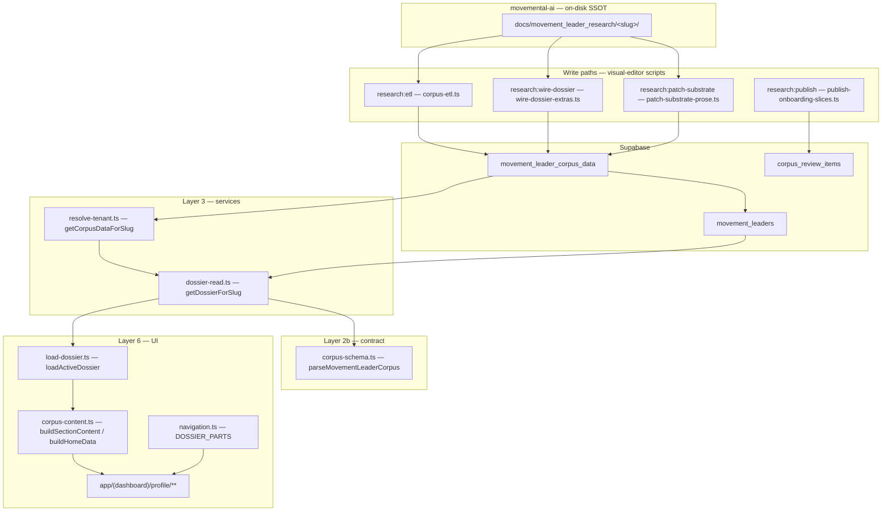

# Author Profile — Database → Frontend Status (Agent Handoff)

**Date:** 2026-06-03  
**Audience:** Another agent (clarification, planning, continuation)  
**Sprint SSOT:** [`docs/build/prompts/author-profile-content-architecture/master_runner.md`](../prompts/author-profile-content-architecture/master_runner.md)  
**Strategy:** [`author-profile-content-architecture-proposal.md`](./author-profile-content-architecture-proposal.md)  
**Supabase project:** `movemental` · ref `vhaiiiykcukrlyvwlgip`  
**Primary app repo:** `movemental-visual-editor-main` (sibling to this repo)  
**Research SSOT on disk:** `movemental-ai/docs/movement_leader_research/<slug>/`

---

## 1. Executive summary

| Question | Answer |
| --- | --- |
| **How far did the plan go?** | Initial sprint **AP-00 → AP-05 is Done**. Optional **AP-90 (Phase 5)** is deferred. Browser QA on `/profile` was **deferred** in every phase. |
| **New Supabase table?** | **No.** Work used existing tables, chiefly `movement_leader_corpus_data`. |
| **Content added?** | **Yes** — on-disk research files, Supabase JSONB rows (prose, `network.dossier`, media lists), and onboarding `corpus_review_items` sync. |
| **Wired DB → frontend?** | **Yes** on the **custom dossier chain** (not generic simplified CRUD hooks). Read path: DB → `getDossierForSlug` → `corpus-schema` → `corpus-content` mappers → `/profile` RSC pages. Write paths differ by leader class (ETL vs SQL-only patch). |

**Two reference leaders below:** **Roy Moran** (`merged:` — safe full ETL) and **Alan Hirsch** (`substrate:` — never re-ETL; targeted SQL patch for identity/bio).

---

## 2. Sprint completion matrix

| Prompt | Status | Primary outcome |
| ---: | --- | --- |
| AP-00 | Done | Baseline audit (16 leaders, ETL safety classes) |
| AP-01 | Done | Roy Moran template: canonical files + 9 `network.dossier` keys |
| AP-02 | Done | 8 merged-cohort leaders: dossier extras ETL + leader-safe scrub |
| AP-03 | Done | Nav 22→18 sections; progressive rail; deprecated slug redirects |
| AP-04 | Done | `corpus_review_items` full-replace sync on publish |
| AP-05 | Done | 5 substrate leaders: `identity` + `biography` via `patch-substrate-prose.ts` |
| AP-90 | Deferred | Catalog promotion, `dossier_sections` rename, inline edit, `at_glance` JSONB, etc. |

---

## 3. Supabase tables (what exists — nothing new from this sprint)

### 3.1 Tables `/profile` reads

| Table | Role | Used by Author Profile? |
| --- | --- | --- |
| **`movement_leader_corpus_data`** | **SSOT** for dossier prose + media JSONB + `network.dossier` | **Yes** — primary |
| **`movement_leaders`** | Name, role, photo, `reflected_understanding_endorsed_at` | **Yes** — shell + endorsement chip |
| **`organizations`** | Tenant resolution (org slug = leader slug) | **Yes** — via `resolveTenantBySlug` |
| **`movement_leader_welcome_letters`** | Welcome copy for **`/welcome`** only | **No** on `/profile` |
| **`corpus_review_items`** | Flattened media for **`/onboarding/corpus`** | **No** on `/profile` (synced from corpus on publish, AP-04) |

### 3.2 Tables `/profile` does **not** read

| Table | Note |
| --- | --- |
| `books`, `content_items`, `videos`, `podcast_episodes` | Product CMS — tenant catalog `/content`; **not** dossier SSOT |
| `substrate_md` (if present on corpus row) | Legacy blob; **not** exposed wholesale in UI |

### 3.3 `movement_leader_corpus_data` columns (Layer 1)

Defined in `movemental-visual-editor-main/src/lib/database/schema.ts`:

| Column | Type | Nav / UI consumers |
| --- | --- | --- |
| `identity` | jsonb `{ markdown }` | Author Profile, At a Glance hero lede |
| `biography` | jsonb `{ markdown }` | Biography, timeline derivation |
| `theology` | jsonb | Theological Profile |
| `calling_profile` | jsonb | Vocational Profile |
| `voice_analysis` | jsonb | Voice & Editorial Identity, voice meters |
| `books`, `articles`, `audio`, `videos` | jsonb arrays | Bibliography, Articles, Audio, Video tables |
| `frameworks` | jsonb array | Frameworks section + home cards |
| `organizations` | jsonb array | Affiliations table on Author Profile |
| `network` | jsonb | `sections[]` (graph), **`dossier{}`** (Part IV–V extras) |
| `reflected_understanding_md` | text | **A Letter** (`/profile/a-letter`) |
| `source_version` | text | Operational: `substrate:` vs `merged:` vs `corpus:` |
| `last_synced_at` | timestamp | Audit only |

There is **no** dedicated column per sidebar slug for audience, web properties, etc. Those live under **`network.dossier[navSlug]`**.

---

## 4. Architecture — custom type chain (not generic six-layer CRUD)



**Do not** wire `/profile` through generated `useMovementLeaderCorpusData*` hooks or simplified REST routes as the primary read path.

---

## 5. Write paths — how data gets into Supabase

| Leader class | `source_version` prefix | Safe `research:etl`? | How to update |
| --- | --- | --- | --- |
| **Substrate** | `substrate:` | **Never** — wipes rich media | `pnpm research:patch-substrate` (identity/bio only); `pnpm research:wire-dossier` (merges `network.dossier` only) |
| **Merged / corpus** | `merged:` / `corpus:` | **Yes** | `pnpm research:etl -- --slug=…` then `pnpm research:publish` |
| **Legacy** | `legacy-write:` | Special | `jamie-roach` — out of sprint scope |

**Ingest rules (all paths):**

- Staff markdown excluded via `RESEARCH_EXCLUDE_BASENAMES` and `stripStaffSections()` (`markdown.ts`).
- Dossier extras: `buildDossierExtrasFromFiles()` → `network.dossier` keys from `DOSSIER_SECTION_FILES` (`dossier-extras.ts`).
- Full ETL also sets `source_version` to `merged:<hash>` or `corpus:<hash>`; substrate patch **does not** change prefix.

**Research root resolution:** `MOVEMENTAL_AI_ROOT` env or default `../movemental-ai` from visual-editor cwd.

---

## 6. Read path — database to `/profile` UI

| Step | File | What happens |
| ---: | --- | --- |
| 1 | `src/app/(dashboard)/profile/layout.tsx` | Shell, nav rail (uses `getVisibleSectionSlugs` for progressive disclosure) |
| 2 | `load-dossier.ts` | `resolveActiveOrganization` → org slug → `getDossierForSlug(slug)` |
| 3 | `dossier-read.ts` | Loads `movement_leaders` + `movement_leader_corpus_data`; `parseMovementLeaderCorpus(row)` |
| 4 | `corpus-schema.ts` | Zod/normalize JSONB → `MovementLeaderCorpus` |
| 5 | `corpus-content.ts` | `resolveSectionMarkdown(corpus, slug)` → `buildSectionContent` → HTML via `marked` |
| 6 | `profile/page.tsx` | At a Glance: `buildHomeData(corpus, leader, endorsed)` |
| 7 | `profile/[sectionSlug]/page.tsx` | Section view; special components for `fragmentation`, `letter`, `frameworks` |

**Tenant switching:** Active org from cookie / `?org=<slug>` (see `active-org` helpers). Org slug equals movement leader slug for author tenants.

**Empty states:**

- `no-data-on-file` — column empty (e.g. missing `identity.markdown`).
- `awaiting-etl-wiring` — research expected under `network.dossier[slug]` but key missing (`wire-dossier-extras` not run or file absent on disk).

---

## 7. Nav slug → database mapping (complete)

**Navigation manifest:** `src/lib/author-dossier/navigation.ts` (18 sections + At a Glance).  
**Resolver:** `resolveSectionMarkdown()` in `src/lib/author-dossier/corpus-content.ts`.

| Nav slug | UI title | Supabase source |
| --- | --- | --- |
| *(home)* | At a Glance | Derived from multiple columns + optional `at_glance` JSONB (not implemented) |
| `author-profile` | Author Profile | `identity` + `organizations[]` table |
| `biography` | Biography | `biography` |
| `theological-profile` | Theological Profile | `theology` |
| `vocational-profile` | Vocational Profile | `calling_profile` |
| `voice-editorial-identity` | Voice & Editorial Identity | `voice_analysis` |
| `bibliography` | Bibliography | `books[]` → markdown table |
| `frameworks` | Frameworks | `frameworks[]` (dedicated view) |
| `articles-blog-posts` | Articles & Blog Posts | `articles[]` |
| `audio-podcast` | Audio & Podcast | `audio[]` |
| `video-content` | Video Content | `videos[]` |
| `content-audit` | Content Audit | `network.dossier['content-audit']` |
| `academic-work` | Academic Work | `network.dossier['academic-work']` |
| `courses-training` | Courses & Training | `network.dossier['courses-training']` |
| `audience-profile` | Audience & Reach | `network.dossier['audience-profile']` |
| `where-you-publish` | Where You Publish | Merges `dossier['web-properties']` + `platforms-publishing` + `newsletters` |
| `social-media` | Social Media | `network.dossier['social-media']` |
| `the-fragmentation-story` | The Fragmentation Story | `network.dossier['the-fragmentation-story']` (fallback: synthesize `network.sections[]`) |
| `a-letter` | A Letter | `reflected_understanding_md` |

### 7.1 On-disk file → `network.dossier` key (`DOSSIER_SECTION_FILES`)

| Dossier key | On-disk path (under `<slug>/`) |
| --- | --- |
| `audience-profile` | `analysis/audience-analysis.md` |
| `web-properties` | `digital-presence/websites.md` |
| `platforms-publishing` | `digital-presence/platforms.md` |
| `social-media` | `digital-presence/social-media.md` |
| `newsletters` | `digital-presence/newsletters.md` |
| `academic-work` | `content/academic.md` |
| `courses-training` | `content/courses.md` |
| `content-audit` | `content/content-audit.md` or `{SLUG}_CONTENT_AUDIT.md` |
| `the-fragmentation-story` | `fragmentation-story.md` |

### 7.2 Deprecated URL redirects (AP-03)

| Old slug | New slug |
| --- | --- |
| `voice-analysis`, `voice-identity` | `voice-editorial-identity` |
| `editorial-bio-research` | `author-profile` |
| `content-analysis` | `bibliography` |
| `web-properties`, `platforms-publishing`, `newsletters` | `where-you-publish` |

---

## 8. Walkthrough A — Roy Moran (`merged:` path)

**Role in program:** Phase 0 template leader — full canonical research + ETL + dossier wire.  
**Loader:** `source_version` ≈ `merged:a4c00…` — **safe** for `pnpm research:etl -- --slug=roy-moran`.

### 8.1 Example: Author Profile section

```text
ON DISK
  movemental-ai/docs/movement_leader_research/roy-moran/profile/identity.md
  movemental-ai/docs/movement_leader_research/roy-moran/network/organizations.md
       │
       ▼  pnpm research:etl  (corpus-etl.ts)
       │    stripStaffSections(identity.md)
       │    organizations → organizations[]
       │
SUPABASE  movement_leader_corpus_data
       │    identity  = { "markdown": "<scrubbed identity>" }
       │    organizations = [ { "markdown": "...", "sourcePath": "network/organizations.md" } ]
       │
       ▼  Server: getDossierForSlug("roy-moran")
       │    parseMovementLeaderCorpus(row)
       │
       ▼  resolveSectionMarkdown(corpus, "author-profile")
       │    collectMarkdown(identity) + organizationsToTable(organizations)
       │
       ▼  buildSectionContent → renderMarkdown → bodyHtml
       │
UI        GET /profile/author-profile?org=roy-moran
          <DossierSectionView />
```

### 8.2 Example: Audience & Reach (dossier extra)

```text
ON DISK
  roy-moran/analysis/audience-analysis.md   (or legacy ROY_MORAN_AUDIENCE_PROFILE.md wired via AP-01)
       │
       ▼  research:etl and/or research:wire-dossier
       │
SUPABASE  network.dossier["audience-profile"] = "<markdown string>"
       │
       ▼  resolveSectionMarkdown(corpus, "audience-profile")
       │    dossierExtraMarkdown(corpus, "audience-profile")
       │
UI        GET /profile/audience-profile
```

### 8.3 Roy Moran — status after sprint (intended)

| Dimension | AP-00 baseline | After AP-01 |
| --- | --- | --- |
| Core prose | 🟢 full | 🟢 full |
| Media (b/a/au/v/fw) | 2/6/6/6/6 | unchanged counts |
| `network.dossier` keys | **2** | **9** (wired) |
| Endorsement | ✅ endorsed | ✅ |
| Browser QA | — | **Deferred** |

---

## 9. Walkthrough B — Alan Hirsch (`substrate:` path)

**Role in program:** Reference tenant + substrate cohort; rich media preloaded historically.  
**Loader:** `source_version` ≈ `substrate:7904…` — **never** `research:etl` (would wipe `videos`, `audio`, etc.).

### 9.1 Example: Author Profile + Biography (AP-05 patch)

```text
ON DISK
  movemental-ai/docs/movement_leader_research/alan-hirsch/profile/identity.md   (~7k chars)
  movemental-ai/docs/movement_leader_research/alan-hirsch/profile/biography.md  (~8k chars)
       │
       ▼  pnpm research:patch-substrate -- --slug=alan-hirsch
       │    (NOT research:etl)
       │    stripStaffSections → UPDATE identity, biography only
       │    source_version UNCHANGED (still substrate:…)
       │
SUPABASE  movement_leader_corpus_data
       │    identity.markdown   length > 500 ✅
       │    biography.markdown  length > 500 ✅
       │    books/articles/audio/videos/frameworks  UNCHANGED (1/14/40/48/7)
       │
       ▼  Same read path as Roy: getDossierForSlug → corpus-content
       │
UI        GET /profile/author-profile?org=alan-hirsch
          GET /profile/biography?org=alan-hirsch
```

### 9.2 Example: Video Content (substrate media — do not re-ETL)

```text
SUPABASE  videos[]  (48 items — from historical substrate loader)
       │
       ▼  resolveSectionMarkdown(corpus, "video-content")
       │    mediaItemsToTable(corpus.videos)
       │
UI        GET /profile/video-content
```

**Product CMS overlap:** Alan may also have rows in `books` / `content_items` for `/content`. That catalog is **out of scope** for this sprint (see AP-90a).

### 9.3 Alan Hirsch — status after sprint

| Dimension | AP-00 baseline | After AP-05 |
| --- | --- | --- |
| `identity` / `biography` | **0 chars** (empty JSONB) | **7267 / 8077 chars** |
| Media (b/a/au/v/fw) | 1/14/40/48/7 | **Δ0** (unchanged) |
| `network.dossier` keys | 9 | 9 (already wired pre-sprint) |
| `reflected_understanding_md` | ~3k chars | unchanged (optional refresh = SQL column only) |
| Browser QA | — | **Deferred** |

---

## 10. Cohort snapshot (post AP-00–AP-05)

Use Supabase MCP to refresh; values below reflect **2026-06-03 sprint close**.

| slug | Loader | identity/bio | dossier keys | Notes |
| --- | --- | --- | ---: | --- |
| **roy-moran** | merged | ✅ | 9 | Template leader |
| **alan-hirsch** | substrate | ✅ (AP-05) | 9 | Reference tenant |
| **brad-brisco** | substrate | ✅ (AP-05) | 9 | |
| **jr-woodward** | substrate | ✅ (AP-05) | 8 | |
| **lucas-pulley** | substrate | ✅ (AP-05) | 8 | |
| **liz-rios** | substrate | ✅ (AP-05) | **2** | Thin on-disk — no `digital-presence/` tree |
| **michael-cooper** | corpus | ✅ | 9 | AP-02 wired |
| **dave-ferguson** | merged | ✅ | 8 | |
| **neil-cole, rob-wegner** | merged | ✅ | 8 | Leader-safe scrubbed AP-02 |
| **andrew-jones, jeremy-chambers, peyton-jones** | merged | partial | 0–9 | Check per-slug MCP |
| **brian-sanders** | merged | partial | 2 | |
| **rowland-smith** | merged | partial | 1 | No RU letter |
| **jamie-roach** | legacy-write | 🔴 | 0 | No corpus row |

---

## 11. What is **not** done (planning hooks)

| Item | Where tracked |
| --- | --- |
| Browser E2E on `/profile?org=…` | Deferred all phases — use Chrome DevTools MCP or Playwright |
| `jamie-roach` corpus row | Out of cohort |
| Product CMS ↔ dossier “In Studio” badges | AP-90a |
| Rename `network.dossier` → `dossier_sections` | AP-90b |
| `at_glance` JSONB overrides | Proposal §2; not built |
| Full `pnpm validate:all` as gate | Custom chain uses `typecheck` + dossier unit tests |
| Vitest for `corpus-review-sync` | AP-04 noted env blocked |

---

## 12. Verification commands (next agent)

**Repo:** `movemental-visual-editor-main`

```bash
pnpm typecheck
pnpm research:verify -- --slug=roy-moran
MOVEMENTAL_AI_ROOT=/path/to/movemental-ai pnpm research:patch-substrate -- --slug=alan-hirsch  # only if re-patching
```

**Supabase MCP** (`project_id: vhaiiiykcukrlyvwlgip`):

```sql
-- Completeness
SELECT ml.slug, mlcd.source_version,
       length(COALESCE(mlcd.identity->>'markdown','')) AS identity_len,
       length(COALESCE(mlcd.biography->>'markdown','')) AS bio_len,
       jsonb_array_length(COALESCE(mlcd.books,'[]'::jsonb)) AS books,
       (SELECT count(*) FROM jsonb_object_keys(COALESCE(mlcd.network->'dossier','{}'::jsonb))) AS dossier_keys
FROM movement_leaders ml
JOIN movement_leader_corpus_data mlcd ON mlcd.movement_leader_id = ml.id
WHERE ml.slug IN ('roy-moran','alan-hirsch')
ORDER BY ml.slug;

-- Leader-safe (must return 0 rows for touched slugs)
SELECT ml.slug FROM movement_leaders ml
JOIN movement_leader_corpus_data mlcd ON mlcd.movement_leader_id = ml.id
WHERE ml.slug = 'alan-hirsch'
  AND (mlcd.biography::text || mlcd.identity::text || mlcd.calling_profile::text
       || mlcd.theology::text || COALESCE(mlcd.reflected_understanding_md,''))
      ~* '(gap.analysis|movemental.fit|movemental.analysis|recommendation:.{0,4}onboard|audience.tam|commerce.recommendation)';
```

**Manual UI:** `http://localhost:3000/profile?org=roy-moran` and `?org=alan-hirsch` — confirm Author Profile + Biography render prose; rail hides empty sections unless `?staff=1`.

---

## 13. Key file index (visual-editor)

| Concern | Path |
| --- | --- |
| Drizzle schema | `src/lib/database/schema.ts` |
| Corpus contract | `src/lib/schemas/corpus-schema.ts` |
| ETL | `src/lib/services/movement-leader-research/corpus-etl.ts` |
| Dossier extras map | `src/lib/services/movement-leader-research/dossier-extras.ts` |
| Substrate patch script | `scripts/patch-substrate-prose.ts` |
| Wire dossier script | `scripts/wire-dossier-extras.ts` |
| Read service | `src/lib/services/movement-leader-research/dossier-read.ts` |
| View mappers | `src/lib/author-dossier/corpus-content.ts` |
| Nav | `src/lib/author-dossier/navigation.ts` |
| Load for RSC | `src/lib/author-dossier/load-dossier.ts` |
| Pages | `src/app/(dashboard)/profile/page.tsx`, `[sectionSlug]/page.tsx` |
| Onboarding sync | `src/lib/services/movement-leader-research/corpus-review-sync.logic.ts` |

---

## 14. Related docs

- Table map (deep): `movemental-visual-editor-main/docs/build/notes/movemental-research-content-supabase-tables.md`
- Alan profile index: `movemental-visual-editor-main/docs/build/notes/alan-hirsch-profile-data-source-index.md`
- Skill (ETL rules): `.claude/skills/movemental-leader-corpus-upload/SKILL.md` — **substrate section**

---

*This document is the conclusive handoff for database → Author Profile frontend status as of AP-05 completion. Update the cohort table after any new ETL or patch run.*
