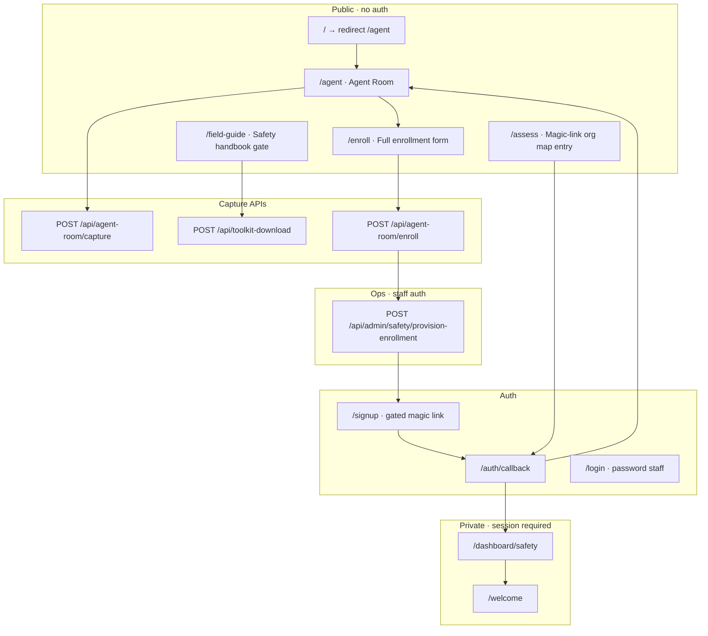

# Home → Safety → Dashboard: flow assessment and current-state documentation

**Purpose.** Give product, engineering, and QA a single reference for how a visitor moves from first contact through the Safety step — via the **free handbook / lead-magnet path** or the **paid managed-dashboard path** — and through **first sign-in** into the private Safety charter dashboard.

**Audience.** Anyone assessing funnel completeness, wiring gaps, auth boundaries, or ops handoffs without re-walking the repo.

**As of.** 2026-06-12 (`movemental-ai` main tree).

**Related build prompts (implementation specs, not duplicated here):**

- [wire-capture-and-enrollment-to-backend.md](./wire-capture-and-enrollment-to-backend.md) — capture spine, lead magnet, enrollment API
- [wire-safety-dashboard-and-auth.md](./wire-safety-dashboard-and-auth.md) — provisioning, gated signup, dashboard auth
- [../notes/home-page-ctas-capture-and-ai-engagement.md](../notes/home-page-ctas-capture-and-ai-engagement.md) — earlier gap audit (partially superseded by shipped work)

---

## 1. Executive summary

| Layer | What it is today |
|-------|------------------|
| **Entry** | `/` redirects to `/agent` (no marketing home yet). The agent room *is* the public front door. |
| **Orientation** | Scripted scene runner (default `hybrid` mode): chips, regex routing, local screens — mostly **no LLM**. |
| **Safety framing** | Stage 01 on the four-step path; dedicated `safety` screen, `toSafety` scenes, and a **Q1 Safety gate** on the in-room diagnostic. |
| **Free path** | Email capture → PDF field guide (`It Starts With Safety`) via `/field-guide`, agent dock, or in-room `free` capture → `newsletter_subscribers` + day-0 email. **Self-serve ratification; no dashboard.** |
| **Paid path** | Narrative sell → `/enroll` full form → `organization_inquiries` → **staff provisioning** → gated `/signup` magic link → `/dashboard/safety`. |
| **First dashboard session** | Supabase magic-link auth, membership link, entitlement check (`workspaceCourses.safety`), React charter dashboard backed by `safety_artifacts*`. |

**Product split (lock this):**

- **Free** = handbook + guidance. Outcome is a ratified charter the org writes itself.
- **Paid ($1,000 · two weeks)** = Movemental drafts all five charter layers; the org reviews/ratifies in a **private, auth-only dashboard** they keep.

Both paths share the same **Safety stage** vocabulary and charter structure; they diverge at **capture + fulfillment**.

---

## 2. System map (surfaces and responsibilities)



**Design system:** Public agent room and utility pages (enroll, signup, field-guide, dashboard shell) use **Ink Band** (`.ink-band-surface` / `InkBandUtilityShell`). See [INK_BAND_DESIGN_CHAIN.md](../../design/INK_BAND_DESIGN_CHAIN.md).

**Tenant model:** Public captures stamp `TENANT_ORG_ID` (Movemental marketing org). The Safety dashboard is **membership-scoped** to the customer's provisioned org — not the marketing tenant alone.

---

## 3. Entry: “home page” today

| Route | Behavior | File |
|-------|----------|------|
| `/` | **Temporary redirect** to `/agent` | `src/app/page.tsx` |
| `/agent` | Full-screen Agent Room (no site chrome) | `src/app/agent/page.tsx` |
| `/agent/*` | Audience decks, assessment sub-route, etc. | `src/app/agent/**` |

There is **no live marketing home page** in this repo. CTAs that would normally live on `/` are expressed as:

- Opening **suggestion chips** on the agent home screen
- **Regex routing** from the composer (`route-input.ts`)
- Direct links from Safety screens (`/field-guide`, `/enroll`, `/assess`)

When the marketing migration completes, expect `/` to become a real surface; until then, treat **`/agent` as the home page** for funnel assessment.

**Proxy / session:** `proxy.ts` refreshes Supabase cookies on every request and sets `x-movemental-shell: room` for `/agent`. Dashboard routes rely on **page-level guards**, not proxy hard-gates.

---

## 4. Agent room mechanics (context for every path)

### 4.1 Modes

| Env | Mode | Effect |
|-----|------|--------|
| `NEXT_PUBLIC_AGENT_ROOM_MODE=stub` | Offline | Scenes only, no network |
| `NEXT_PUBLIC_AGENT_ROOM_MODE=hybrid` | **Default** | Local scenes + selective LLM via `/api/agent-room/stream` |
| `NEXT_PUBLIC_AGENT_ROOM_MODE=stream` | Legacy | Every turn hits the engine |

### 4.2 How input is routed

1. **Suggestion chips** → scene names in `src/lib/agent-room/data/scenes.ts` (or special handlers in `suggest-chip-targets.ts`)
2. **Typed text** → ordered regex table in `route-input.ts` (e.g. `/safety|charter|handbook/` → `toSafety`)
3. **Unmatched text / Discuss mode** → LLM stream (only if engine env configured)

There is **no visible chat history** in normal use — a single-line composer drives the experience.

### 4.3 Opening scene (`SCENES.opening`)

Default chips after the greeting:

| Chip | Scene | Leads toward |
|------|-------|--------------|
| Get a clear next AI step | `toBeatCold` | In-room diagnostic (Q1 Safety gate) |
| About Movemental | `whatIs` | About screen |
| What does it cost? | `cost` | Pricing → often `toSafety` |
| Get in touch | `talkToUs` | Contact screen |

**Home screen content:** trust headline + leader band (`HomeScreen`). Eyebrow/audience context lives in the mast.

---

## 5. Paths that reach Safety (before the fork)

Visitors can arrive at Safety framing through multiple branches. All converge on either **`toSafety`** (explainer screen) or **`readback`** (post-diagnostic Safety scene).

### 5.1 Direct Safety navigation

| Trigger | Scene chain | Screen |
|---------|-------------|--------|
| Chip / scene `toSafety` | voice lines → chips | `safety` (`SafetyScreen`) |
| Pricing → “Start with Safety (free)” | `toSafety` | `safety` |
| Path screen → “Show me Safety” | `toSafety` | `safety` |
| Regex: safety, charter, handbook, ratif | `toSafety` | `safety` |

**`SafetyScreen`** (`src/components/agent-room/screen/stub/safety-screen.tsx`):

- Stakes copy, stat band (linked to `/footnotes#…`)
- Five charter layers + deliverables
- **`TwoWaysForward`** component — the primary on-page fork:
  - **Free:** CTA → `/field-guide`
  - **Paid:** CTA → `/enroll`

### 5.2 In-room diagnostic (Organizational Reality Map)

| Trigger | Scene | Screen |
|---------|-------|--------|
| “Get a clear next AI step” (cold) | `toBeatCold` | `beat` (Q1 only hint) |
| “Map where we actually stand” | `toBeat` | `beat` (full or continued) |
| Regex catch-all | `toBeat` | `beat` |

**Question 1 is the Safety gate** (`src/lib/agent-room/data/map-q.ts`):

- **Prompt:** Has leadership decided in writing what the org will/won't do with AI?
- **Pass (`gatePass`):** all four criteria on paper → continue to Q2–Q4
- **Fail (`gateFail`):** stop assessment → **Safety readback** (`clearedSafety: false`)

Most visitors fail Q1; that is intentional product design.

### 5.3 Post-diagnostic readback

`ReadbackScreen` (`readback-screen.tsx`) is **dual-mode**:

| Condition | UI |
|-----------|-----|
| `!mapRead.clearedSafety` | **`SafetyReadbackScene`** — charter spread, plan cards, handbook dock |
| `mapRead.clearedSafety` | Standard gap readback → next move Sandbox + link to `/assess` |

**Safety readback** includes:

- Hero + path rail (Safety = “you are here”)
- Interactive charter document spread (draft previews in lightbox)
- **`SafetyPlanCards`** — free vs paid doors (same fork as Safety screen)
- Link: “Take the full AI reality assessment → `/assess`”

When the Safety gate fails, the agent dock can show **`HandbookDockEmail`** (inline free capture).

---

## 6. The fork: free vs paid

Both paths promise the **same ratified Safety Charter** (five layers). Copy is explicit: free = you hold the pen; paid = Movemental runs the sprint in a dashboard.

### 6.1 Free path (lead magnet / handbook)

**Offer:** *It Starts With Safety* field guide (PDF). Self-paced (~1–2 months). No private dashboard.

#### Entry surfaces

| Surface | User action | Next step |
|---------|-------------|-----------|
| `SafetyScreen` → “Start free, guided” | Navigate | `/field-guide` |
| `SafetyReadbackScene` → free door CTA | Run scene `focusHandbook` | Dock email capture expands |
| Scene chips “Start free, guided” | `focusHandbook` | Dock `#handbookEmail` focused |
| Agent dock `HandbookDockEmail` | Submit email | `submitLead("free", …)` |
| Standalone `/field-guide` | Form submit | `POST /api/toolkit-download` |

#### Backend chain (free)

```
submitLead("free") or /api/toolkit-download
  → recordFieldGuideLead()
  → newsletter_subscribers (source: safety-toolkit:{surface}, status: confirmed)
  → sendToolkitLeadEmail() — day-0 PDF
  → agent_room_leads row (when via capture API)
```

**Key files:**

- `src/lib/leads/field-guide-lead.ts` — shared lead + email logic
- `src/app/api/toolkit-download/route.ts` — standalone field-guide API
- `src/app/api/agent-room/capture/route.ts` — `kind: "free"` branch
- `src/components/field-guide/field-guide-page-content.tsx` — live form on `/field-guide`
- PDF: `public/downloads/` (Safety guide)

**Follow-ups:** Copy promises a follow-up email; **day-3/day-7 cron** may still be partial — verify `vercel.json` cron and `send-safety-toolkit-email.ts` before claiming full nurture sequence in prod.

**What free does *not* do:**

- No `organization_inquiries` row
- No provisioning
- No `/signup` or `/dashboard/safety`
- No Stripe

#### Free-path assessment verdict

| Step | Status | Notes |
|------|--------|-------|
| `/field-guide` form | **WORKING** | Posts to toolkit API |
| Agent dock handbook capture | **WORKING** | Uses capture API |
| Durable lead log | **WORKING** | `agent_room_leads` |
| Day-0 PDF email | **WORKING** | Requires `RESEND_API_KEY` |
| Day-3/7 sequence | **PARTIAL** | Confirm cron shipped |
| Marketing home CTA | **MISSING** | No `/` home yet |

---

### 6.2 Paid path (managed dashboard · $1,000)

**Offer:** Two-week managed sprint; Movemental drafts five layers; org ratifies in **private dashboard**; board-ready package.

#### Entry surfaces

| Surface | User action | Next step |
|---------|-------------|-----------|
| `SafetyScreen` paid CTA | Link | `/enroll` |
| Scene `toSafetyDashboard` | Chip “Get started with the dashboard” | `toEnroll` → **`window.location.assign("/enroll")`** |
| `SafetyReadbackScene` paid door | Run scene `toSafetyDashboard` | Conversion screen → enroll chip |
| `SafetyPlanCards` paid CTA | `toSafetyDashboard` scene chain | Same |
| Legacy scene `withUs` | Inline `capture` kind `paid` | Lightweight lead only (see below) |

**Conversion screen:** `SafetyDashboardScreen` — narrative sell from `SAFETY_DASHBOARD_COPY`; CTA href **`/enroll`**.

#### Lightweight vs full enrollment

| Mechanism | Fields | Table | Purpose |
|-----------|--------|-------|---------|
| In-room `capture` **`paid`** | name, email, org, role | `agent_room_leads` + team notify | **Interest signal** only |
| **`/enroll`** full form | org + contact + timeline + context + payment copy | `organization_inquiries` | **Real enrollment** |

Product intent: **`/enroll` is the canonical paid conversion.** The in-room `paid` capture is a shallow hand-raise; ops should treat `/enroll` submissions as authoritative.

#### `/enroll` page

**Route:** `src/app/enroll/page.tsx` (Ink Band utility layout)

Collects:

- Contact name, email, timeline
- Organization name, type, team size, optional budget
- Free-text context (“where your organization stands with AI”)

**Payment today:** UI describes **$1,000 via Stripe**, but checkout is **manual** — team sends a Stripe payment link after submit (no embedded Stripe on the form).

**POST:** `/api/agent-room/enroll` → `organizationInquiriesService.create({ status: "new" })` + `notifyAgentRoomLead`.

**Success copy:** Provisioning within 24h; magic-link signup email after provisioning; dashboard not immediate on submit.

#### Ops provisioning (paid → org + artifacts)

**Trigger:** Staff-only `POST /api/admin/safety/provision-enrollment` with `{ inquiryId }`.

**Service:** `provisionEnrollment()` in `src/lib/services/safety/provision-enrollment.ts`

| Step | Action |
|------|--------|
| 1 | Load inquiry; idempotent if already `provisioned` |
| 2 | Create `organizations` row (slug, `settings.workspaceCourses: ["safety"]`, `onboarding_state.safety_dashboard`) |
| 3 | Seed **five** `safety_artifacts` + initial `safety_artifact_versions` |
| 4 | Set inquiry `status → "provisioned"` |
| 5 | Email `sendSafetyDashboardReadyEmail()` → `/signup?email=…&inquiry=…` |

**Membership is not created at provision time** — it is created at first signup via `linkEnrolledUser`.

#### Paid-path assessment verdict

| Step | Status | Notes |
|------|--------|-------|
| Narrative sell in room | **WORKING** | Static screen + scenes |
| `/enroll` form → DB | **WORKING** | Full inquiry shape |
| Team notification | **WORKING** | On enroll + capture |
| Automated provisioning | **WORKING** | Staff API (not self-serve) |
| Stripe on-page checkout | **NOT SHIPPED** | Manual payment link |
| In-room `paid` capture → inquiry | **PARTIAL** | Notifies only; use `/enroll` |

---

## 7. Parallel front door: `/assess` (org AI reality map)

`/assess` is **adjacent** to the Safety funnel, not a substitute for `/enroll`.

| Aspect | `/assess` | `/signup` (Safety customers) |
|--------|-----------|------------------------------|
| Purpose | Free org-wide reality map | Account creation after paid enrollment |
| Auth | Magic link, **open** (`shouldCreateUser: true`) | Magic link, **gated** (provisioned inquiry) |
| Landing | `/agent` (authenticated map in room) | `/dashboard/safety` |
| Gate API | None | `POST /api/safety/signup-gate` |

Assessment persistence ties into `systemReadinessAssessments` / map capture via `/api/agent-room/capture` (`kind: "map"`) and auth callback backfill.

**Safety readback** and **Safety screen** both link to `/assess` for “full organizational assessment.”

---

## 8. Auth and first sign-in to the dashboard

### 8.1 Signup flow (paid customers)

```mermaid
sequenceDiagram
  participant User
  participant Signup as /signup
  participant Gate as /api/safety/signup-gate
  participant Supabase
  participant CB as /auth/callback
  participant Link as linkEnrolledUser
  participant Dash as /dashboard/safety

  User->>Signup: email (+ inquiry query)
  Signup->>Gate: POST email
  Gate-->>Signup: allowed if provisioned
  Signup->>Supabase: signInWithOtp
  Supabase->>User: magic link email
  User->>CB: click link (code exchange)
  CB->>Link: auth user + inquiry
  Link->>Link: user_profiles + organization_memberships
  CB->>Dash: redirect next=/dashboard/safety
  Dash->>Dash: requireSafetyDashboardSession()
```

**`/signup`** (`src/app/signup/page.tsx`):

- ADR: magic link for Safety customers; staff use password at `/login`
- Prefill `?email=`; optional `?inquiry=` token
- **`canEnrolledEmailSignUp`** — provisioned inquiry or pending/active membership

**`/auth/callback`** (`src/app/auth/callback/route.ts`):

- PKCE session exchange
- If `inquiry` or `next` starts with `/dashboard/safety` → **`linkEnrolledUser`**
- Email mismatch → `/signup?error=email_mismatch`
- AI Reality map identity backfill when applicable

**`linkEnrolledUser`** (`src/lib/services/safety/link-enrolled-user.ts`):

- Resolves org from inquiry's `onboarding_state.safety_dashboard.inquiry_id`
- Creates/aligns `user_profiles` (id = auth UUID)
- Creates `organization_memberships` (role `owner`, status `active`)
- Idempotent for same email + org

### 8.2 Dashboard guard

**`requireSafetyDashboardSession`** (`src/lib/dashboard/require-dashboard-session.ts`):

| Check | Failure redirect |
|-------|------------------|
| No session | `/signup?next=/dashboard/safety` |
| No org membership | `/login?reason=no_org&next=/dashboard/safety` |
| No `workspaceCourses.safety` | `/welcome?reason=no_safety_entitlement` |
| Pass | Load charter payload |

**Context resolution:** `resolveDashboardContextForSessionUser()` in onboarding service — org slug, persona, entitlements.

### 8.3 First dashboard experience

**Route:** `/dashboard/safety` → `CharterDashboardShell`

**Data:** `loadCharterDashboardForOrg()` aggregates:

- Organization metadata
- `safety_artifacts` list
- Latest `safety_artifact_versions` bodies
- Completion / publish stats

**Editing APIs (authenticated, entitlement-checked):**

- `GET /api/safety/charter-dashboard`
- `PATCH /api/safety/artifacts/[id]/draft`
- `POST /api/safety/artifacts/[id]/publish`

**`/dashboard`** (root): authenticated users redirect to `/dashboard/ai-reality` — Safety customers should deep-link to `/dashboard/safety` (emails and guards do).

**`/welcome`:** Post-auth onboarding stub; shows “Open Safety dashboard” when entitlement present.

### 8.4 Auth surfaces comparison

| Route | Auth method | Who | Typical `next` |
|-------|-------------|-----|----------------|
| `/assess` | Magic link (open) | Any visitor | `/agent` |
| `/signup` | Magic link (gated) | Provisioned enrollments | `/dashboard/safety` |
| `/login` | Password | Staff / returning users | `/dashboard`, `/program`, etc. |
| `/forgot-password` | Recovery | Password users | — |

All post-auth redirects use **`sanitizeAuthRedirectNext`**.

---

## 9. Data layer reference

### 9.1 Tables by funnel step

| Step | Table(s) | Tenant scope |
|------|----------|--------------|
| Any agent capture | `agent_room_leads` | `TENANT_ORG_ID` |
| Free handbook | `newsletter_subscribers` | `TENANT_ORG_ID` |
| Full enrollment | `organization_inquiries` | Global inquiry queue |
| Provisioning | `organizations`, `safety_artifacts`, `safety_artifact_versions` | Customer `organization_id` |
| Signup link | `organization_inquiries.status = provisioned` | — |
| First login | `user_profiles`, `organization_memberships` | Customer org |
| Dashboard reads | `safety_artifacts*`, `safety_artifact_publications` | Customer org |

### 9.2 API route matrix

| Surface | Method | Route | Auth |
|---------|--------|-------|------|
| In-room capture | POST | `/api/agent-room/capture` | Public (rate-limited) |
| Field guide page | POST | `/api/toolkit-download` | Public |
| Enrollment | POST | `/api/agent-room/enroll` | Public |
| Provision | POST | `/api/admin/safety/provision-enrollment` | Staff session |
| Signup gate | POST | `/api/safety/signup-gate` | Public |
| Charter load/save | GET/PATCH/POST | `/api/safety/*` | Session + entitlement |
| Generated CRUD | * | `/api/simplified/safety-artifacts*` | **Not sufficient alone** — use domain routes / RLS |

### 9.3 Type-safety chain

Safety artifacts follow the six-layer chain documented in [TYPE_SAFETY_CHAIN.md](../../architecture/TYPE_SAFETY_CHAIN.md):

```
Drizzle (safety_artifacts*) → Zod → services → /api/simplified/* + hand /api/safety/* → hooks → CharterDashboardShell
```

Domain logic lives in `src/lib/services/safety/` (not generated files).

---

## 10. Email and notifications

| Event | Function | Recipient |
|-------|----------|-----------|
| Free handbook submit | `sendToolkitLeadEmail` | Visitor |
| Map capture (in-room) | `sendMapResultEmail` | Visitor |
| Enroll submit | `notifyAgentRoomLead` | Internal team |
| Paid capture (in-room) | `notifyAgentRoomLead` | Internal team |
| Post-provision | `sendSafetyDashboardReadyEmail` | Enrolled contact → `/signup` link |
| Contact / discuss | `notifyContactInbox`, ack | Team + visitor |

**Degradation:** Missing `RESEND_API_KEY` skips sends with `console.warn` — user-facing success may still show. Treat as **ops risk** in assessment.

---

## 11. Scene and chip quick reference (Safety funnel)

| Chip / scene target | Effect |
|---------------------|--------|
| `toSafety` | Safety explainer screen |
| `toSafetyDashboard` | Dashboard conversion screen |
| `toEnroll` | **Hard navigation to `/enroll`** |
| `focusHandbook` | Expand dock; focus handbook email |
| `focusMapEmail` | Focus readback inline email |
| `withUs` | Legacy: inline `paid` capture (shallow) |
| `focusHandbook` / `onOwn` | Voice + dock gesture for free email |

**Paid door scene chain (`SAFETY_DOORS` paid):** `scene: "toSafetyDashboard"` → chips → `toEnroll` → `/enroll`.

**Free door:** `scene: "focusHandbook"` → dock capture.

---

## 12. End-to-end journeys (narrative)

### 12.1 Free — “Start free, guided”

1. Visitor lands on `/` → `/agent`.
2. Opening chip or path → Safety (`toSafety`) **or** fails Q1 → Safety readback.
3. Chooses free door → `/field-guide` **or** submits email in agent dock.
4. Email stored; PDF sent; optional `agent_room_leads` row.
5. Org works through handbook offline; **no dashboard access**.
6. Optional: returns later for paid `/enroll` or `/assess` for deeper map.

### 12.2 Paid — “Have us do it · $1,000”

1. Visitor lands on `/agent`; reaches Safety via path/pricing/diagnostic.
2. Chooses paid door → dashboard sell screen → **`/enroll`**.
3. Submits org + contact details; inquiry row `status: new`; team notified.
4. **Staff** runs provision API → org + artifacts + `provisioned` + signup email.
5. Visitor opens `/signup?email=…&inquiry=…`; passes gate; receives magic link.
6. Callback links profile + membership; redirects to **`/dashboard/safety`**.
7. First session: review seeded draft charter layers; edit/publish via domain APIs.

### 12.3 Returning user

- **Safety customer:** `/login` (if password set) or magic link from `/signup` again → `/dashboard/safety`.
- **Staff:** `/login` password → program/admin surfaces.

---

## 13. Assessment checklist (for reviewers)

Use this section to score the funnel at “documentation level” without re-auditing code.

### 13.1 Product clarity

- [ ] Free vs paid difference is stated in UI (Safety screen, readback doors, field-guide vs enroll copy)
- [ ] Paid path does not promise instant dashboard on enroll submit
- [ ] Same charter outcome, different fulfillment model

### 13.2 Conversion wiring

- [ ] `submitLead` POSTs to `/api/agent-room/capture` (not console-only)
- [ ] `/field-guide` and dock free capture share `recordFieldGuideLead`
- [ ] `/enroll` writes full `organization_inquiries` shape
- [ ] `toEnroll` chip routes to `/enroll` (not inline mock)

### 13.3 Ops handoff

- [ ] Staff can provision by `inquiryId`
- [ ] Provision is idempotent
- [ ] Provision email contains signup link with email + inquiry params
- [ ] Manual Stripe process documented for CS

### 13.4 Auth boundaries

- [ ] Open signup cannot access `/dashboard/safety` without entitlement
- [ ] `/signup` gate returns generic copy for unknown emails
- [ ] Email mismatch on callback surfaces clearly
- [ ] `requireSafetyDashboardSession` fails closed

### 13.5 Dashboard first run

- [ ] Five artifact seeds exist after provision
- [ ] Charter shell loads org name + layers
- [ ] Sign out returns to `/login`

### 13.6 Known gaps to track explicitly

| Gap | Impact | Tracking |
|-----|--------|----------|
| No marketing `/` home | Secondary CTAs have no page-level home | Marketing migration |
| Stripe not embedded on `/enroll` | Manual payment step | Product/ops |
| In-room `paid` capture ≠ full enroll | Ops may get shallow leads | Funnel analytics |
| Day-3/7 email cron | Nurture incomplete | wire-capture Phase 8 |
| RLS on `safety_artifacts*` | Defense in depth | wire-safety-dashboard Phase 7 |
| `/dashboard` default → ai-reality | Safety users need deep links | UX polish |

---

## 14. Environment and configuration

| Variable | Role in this flow |
|----------|-------------------|
| `TENANT_ORG_ID` | Required for public captures (`agent_room_leads`, toolkit) |
| `NEXT_PUBLIC_SUPABASE_URL` / `ANON_KEY` | Auth (assess, signup, callback) |
| `DATABASE_URL` | All persistence |
| `RESEND_API_KEY` | Transactional emails |
| `NEXT_PUBLIC_SITE_URL` | Email links (signup, login) |
| `NEXT_PUBLIC_AGENT_ROOM_MODE` | stub / hybrid / stream |
| `NEXT_PUBLIC_AGENT_ROOM_DISCUSS` | Open Discuss capture (default off) |
| `AI_AGENTS_BASE_URL` + service secret | Live LLM in hybrid/stream only |

Validate locally: `pnpm check:env`, `pnpm dev`, manual matrix in [wire-safety-dashboard-and-auth.md](./wire-safety-dashboard-and-auth.md) Phase 10.

---

## 15. File index (primary touchpoints)

| Concern | Path |
|---------|------|
| Root redirect | `src/app/page.tsx` |
| Agent room shell | `src/components/agent-room/agent-room-shell.tsx` |
| Scenes / choreography | `src/lib/agent-room/data/scenes.ts` |
| Safety gate questions | `src/lib/agent-room/data/map-q.ts` |
| Safety screen | `src/components/agent-room/screen/stub/safety-screen.tsx` |
| Safety readback | `src/components/agent-room/screen/safety-readback-scene.tsx` |
| Dashboard sell screen | `src/components/agent-room/screen/stub/safety-dashboard-screen.tsx` |
| Capture seam | `src/lib/agent-room/capture.ts` |
| Chip special routes | `src/lib/agent-room/suggest-chip-targets.ts` |
| Field guide page | `src/app/field-guide/page.tsx` |
| Enrollment page | `src/app/enroll/page.tsx` |
| Signup | `src/app/signup/page.tsx` |
| Auth callback | `src/app/auth/callback/route.ts` |
| Dashboard page | `src/app/dashboard/safety/page.tsx` |
| Session guard | `src/lib/dashboard/require-dashboard-session.ts` |
| Provision service | `src/lib/services/safety/provision-enrollment.ts` |
| Membership link | `src/lib/services/safety/link-enrolled-user.ts` |
| Signup gate | `src/lib/services/safety/enrollment-gate.ts` |

---

## 16. Summary verdict (current state)

| Funnel segment | Verdict |
|----------------|---------|
| Entry `/` → `/agent` | **WORKING** (redirect only) |
| Safety education (screens + readback) | **WORKING** |
| In-room diagnostic Safety gate | **WORKING** |
| Free handbook capture (field-guide + dock) | **WORKING** |
| Paid narrative → `/enroll` | **WORKING** |
| Inquiry persistence + team notify | **WORKING** |
| Staff provisioning → artifacts | **WORKING** (manual trigger) |
| Gated signup + magic link | **WORKING** |
| First login → `/dashboard/safety` | **WORKING** |
| Embedded Stripe checkout | **NOT SHIPPED** |
| Marketing home with explicit CTAs | **NOT SHIPPED** |
| Full email nurture (day 3/7) | **VERIFY** |

This document is the **assessment layer**. Implementation changes should continue to follow the wire-* build prompts and the type-safety chain; update this file when funnel behavior materially changes.
